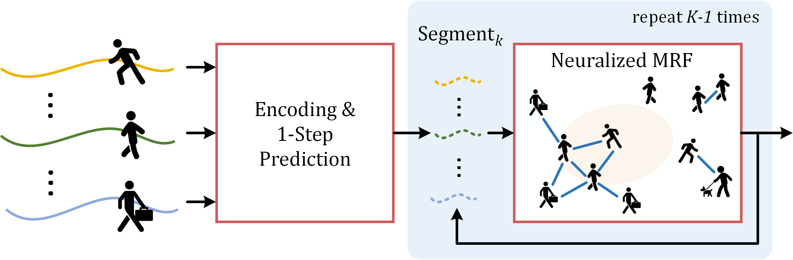

# Neuralized Markov Random Field for Interaction-Aware Stochastic Human Trajectory Prediction

PyTorch implementation for ICLR'25 paper [Neuralized Markov Random Field for Interaction-Aware Stochastic Human Trajectory Prediction](https://openreview.net/forum?id=r3cEOVj7Ze).


## 1. Overview

**Abstract**. Interactive human motions and the continuously changing nature of intentions pose significant challenges for human trajectory prediction. In this paper, we present a neuralized Markov random field (MRF)-based motion evolution method for probabilistic interaction-aware human trajectory prediction. We use MRF to model each agent's motion and the resulting crowd interactions over time, hence is robust against noisy observations and enables group reasoning. We approximate the modeled distribution using two conditional variational autoencoders (CVAEs) for efficient learning and inference. Our proposed method achieves state-of-the-art performance on ADE/FDE metrics across two dataset categories: overhead datasets ETH/UCY, SDD, and NBA, and ego-centric JRDB. Furthermore, our approach allows for real-time stochastic inference in bustling environments, making it well-suited for a 30FPS video setting.

<div align="center">  
  
</div>


## 2. Pytorch Implementation

Train logs and all datasets are contained in the `./logs` and `./processed_datasets` folders. Please download the pretrained models from [Google Drive](https://drive.google.com/drive/folders/1QdSx9Er0laPR8YIjC4dWhp1lZhxxtuLh?usp=sharing).


### 2.1 Environment Setup

We train and evaluate our model on Ubuntu 20.04 with one Quadro RTX 8000 GPU, and the conda environment is configured with `python=3.7.16` and `torch=1.8.0`.

The codes have also been tested with torch=1.11.0 and torch=2.5.1, and both versions work.


### 2.2 Datasets

**ETH-UCY**. The raw data is referenced from [SR-LSTM](https://github.com/zhangpur/SR-LSTM/tree/master) and [STAR](https://github.com/cunjunyu/STAR/tree/master), and we include it under `./preprocess/raw_data/`. The train-validation-test splits adhere to the original [Social-GAN](https://github.com/agrimgupta92/sgan) paper.

**SDD**. The dataset is referenced from [SocialVAE](https://github.com/xupei0610/SocialVAE/tree/main), where they provide SDD in *meters*. We include the raw data under `./preprocess/raw_data/sdd/`

**NBA**. We use the same data and train-test splits provided by the previous SOTA model [LED](https://github.com/MediaBrain-SJTU/LED/tree/main).

**JRDB**. Please refer to the official [website](https://jrdb.erc.monash.edu/) to register and download the dataset. They provide images, point clouds, ROS bags, etc., for usage. An official [toolkit](https://github.com/JRDB-dataset/jrdb_toolkit) is available to preprocess the raw data for different tasks. We mainly use the `tracking_eval` part to obtain trajectory sequences.

Since registration and login are required to download JRDB, we do not include any raw data here. A preprocessed version for the stochastic prediction task (N=20) is provided in `./processed_datasets`. If this also raises copyright concerns, please contact us, and we will remove it.


### 2.3 Training

We include all processed datasets in the `./processed_datasets` folder, except for the NBA dataset, as it is large. We attach it to the same [Google Drive](https://drive.google.com/drive/folders/1QdSx9Er0laPR8YIjC4dWhp1lZhxxtuLh?usp=sharing) link as the pre-trained model. Download the `nba.zip` file, place it in the `./processed_datasets` folder, and unzip it.

If you're interested, feel free to replicate the data preprocessing yourself:
```bash
cd preprocess
python prepare_ethucy.py && cd ..
```

As described, the training process consists of two stages: CVAE Training and Sampler Training. Use the following command to start the first stage, where you can freely specify the log name with the argument `--log`
```bash
python main.py --dataset nba --train --log default  # 'default' can be replaced by any other name you like
```

Then, choose the best checkpoint based on the *validation* results and start the second stage. For example, if epoch 150 is the best, you will run:
```bash
python main.py --dataset nba --train --log default --use_sampler --epoch 150
```

Train logs are saved in the `./logs` folder, and checkpoints are automatically saved in the `./results` folder, which is created by the code.


### 2.4 Testing

Simply run the command:
```bash
python main.py --dataset XXX --log XXX --use_sampler --epoch XXX
```
Remember there is **no** `--train` argument.

If you would like to test our pre-trained model, download and unzip the `results.zip` file in the main folder, and run:
```bash
# For ETH-UCY dataset
python main.py --dataset eth --log default --use_sampler --epoch 47
python main.py --dataset hotel --log default --use_sampler --epoch 44
python main.py --dataset univ --log default --use_sampler --epoch 15
python main.py --dataset zara1 --log default --use_sampler --epoch 47
python main.py --dataset zara2 --log default --use_sampler --epoch 55

# For SDD dataset
python main.py --dataset sdd --log default --use_sampler --epoch 80

# For NBA dataset
python main.py --dataset nba --log default --use_sampler --epoch 14

# For JRDB dataset
python main.py --dataset jrdb --log default --use_sampler --epoch 49
```

With the pre-trained models, you will get:
| Dataset     |     ADE     |     FDE     |
| :---------- | :---------: | :---------: |
| ETH         |    0.2531   |    0.3746   |
| HOTEL       |    0.1125   |    0.1683   |
| UNIV        |    0.2763   |    0.4872   |
| ZARA1       |    0.1806   |    0.3040   |
| ZARA2       |    0.1405   |    0.2475   |
| SDD         |    7.0960   |   11.1058   |

```text
# For NBA dataset
--ADE(1s): 0.1646       --FDE(1s): 0.2404
--ADE(2s): 0.3376       --FDE(2s): 0.5006
--ADE(3s): 0.5338       --FDE(3s): 0.7433
--ADE(4s): 0.7500       --FDE(4s): 0.9654

# For JRDB dataset
--ADE(1.2s): 0.0430     --FDE(1.2s): 0.0539
--ADE(2.4s): 0.0769     --FDE(2.4s): 0.1099
--ADE(3.6s): 0.1134     --FDE(3.6s): 0.1672
--ADE(4.8s): 0.1516     --FDE(4.8s): 0.2256
```

## Citation

If you find this repo useful, please consider citing our paper as:
```bibtex
@inproceedings{
fang2025neuralized,
title={Neuralized Markov Random Field for Interaction-Aware Stochastic Human Trajectory Prediction},
author={Zilin Fang and David Hsu and Gim Hee Lee},
booktitle={The Thirteenth International Conference on Learning Representations},
year={2025}
}
```


## Reference

The code base heavily borrows from [LED](https://github.com/MediaBrain-SJTU/LED/tree/main), with the discrepancy loss function referring to [NPSN](https://github.com/InhwanBae/NPSN) and the data preprocessing part for ETH-UCY and SDD referring to [Social-STGCNN](https://github.com/abduallahmohamed/Social-STGCNN).